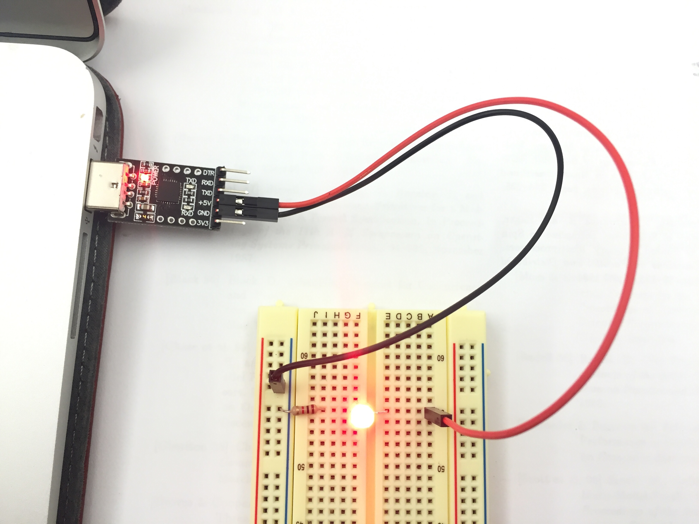
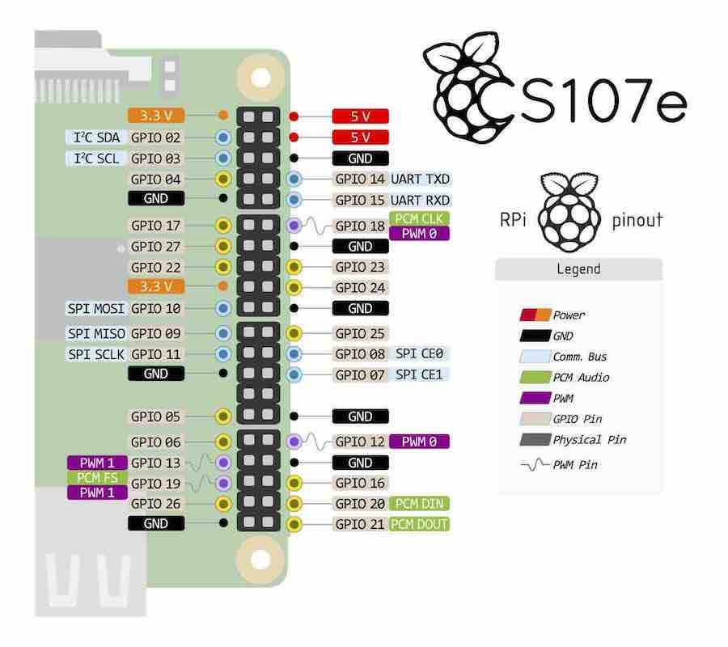
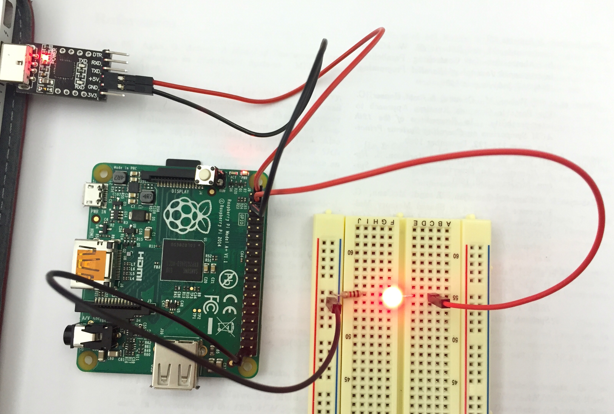


Task list to copy/paste when creating PR for this lab:

__Before releasing lab1:__
- [ ] Review writeup/code/checkin questions (instructor)
- [ ] Walk through (SL)
- [ ] Followup on any github issue from previous

__To prep for lab1:__
- [ ] Confirm installation instructions are up-to-date
- [ ] Piazza announcement for students to bring adapter if their computer doesn't have USB-A port A (e.g. recent Macs)
- [ ] Confirm lab cabinet has SD card readers for various computers
- [ ] Prepare some SD cards with bootloader in case students can't prep their own
- [ ] Bring blank labels and pens -- students make name tag and decorate kit box
- [ ] Create Google sheet with class roster to record lab attendance
- [ ] Review tips recorded in private/staff_notes.md



*Lab written by Pat Hanrahan*

## Goals

During this lab you will:

1.  Learn how to cross-develop on your computer for the Raspberry Pi's ARM processor.
2.  Learn how to use a breadboard with LEDs and buttons.
3.  Learn how to download and run bare metal programs on the Raspberry Pi.

## How does lab work?

When you arrive at lab, find a partner and introduce yourself to one another.
Together you will tackle the exercises outlined below.
Everyone is encouraged to collaborate with other labmates 
to share insights and offer each other useful tips.
The instructor and TA will circulate the room
to offer advice and answers 
so as to keep everyone progressing smoothly.

Lab is a time to experiment and explore. We introduce topics in readings/lectures, and the guided exercises in lab follow up to further your understanding, put your knowledge to work, give you practice with the tools in a supported environment, and prepare you to succeed at this week's assignment.

Bare metal programming requires precision. A trivial error or slight misunderstanding can totally block your progress; the resolution may be simple yet almost impossible to see yourself. Our goal in the lab is to get you past these sticking points. Use our support to keep your momentum up and avoid the frustration from fighting with problems that appear insurmountable!

Each lab has a set of check-in questions that
you can use to self-test your understanding. Try to answer
these questions as you go and please talk with us to resolve any confusion. The check-in questions are intentionally simple and your responses are not graded; we use them as a gauge of how you're doing with the material so that we know better how to help guide you.

To
get the most out of lab, you should not aim to do the minimum required of you in the
shortest possible time.  If you already have a good handle on the material, use the lab period to dive into further nooks and crannies or help out those peers who could benefit from your experience.  You should also
get to know the instructors.  They are masters of the craft, and you will learn
a lot by talking to them and asking them questions.  Any topic is fair game.

The combination of hands-on experimentation,
give and take with your peers,
and the expert guidance of our staff 
is what makes lab time truly special.
Your sincere participation can really accelerate your learning!

## Prelab preparation

To prepare, please do the following before coming to lab:

1. Install the necessary tools on your laptop:
  - If you are using a Windows laptop, install a virtual machine
  running Linux following our [VM install instructions](/guides/vmware/). This virtual machine will have the arm cross-development tools already installed.
  - If you are using a Mac laptop, follow our [Mac install instructions](/guides/mac_toolchain/) to install the arm cross-development tools, console drivers, and uploader script.
  You do not have to install a virtual machine,
  since OS X is already based on UNIX.
1. Make sure you have installed and learned how to use Git. (You should have
  completed this in [Assignment 0](/assignments/assign0).)
1. Review our guide to the  [Unix command line](/guides/unix/).

You should come to lab with working versions of the cross-development
tools (all beginning with `arm-none-eabi-`) and a running version of
git. Test your setup by opening a Terminal, typing the following commands, and confirm you get the responses shown below:

    $ arm-none-eabi-as --version
    GNU assembler (GNU Tools for ARM Embedded Processors) 2.24.0.20150604
    Copyright 2013 Free Software Foundation, Inc.
    This program is free software; you may redistribute it under the terms of
    the GNU General Public License version 3 or later.
    This program has absolutely no warranty.
    This assembler was configured for a target of `arm-none-eabi'.

    $ git --version
    git version 1.9.3

If this doesn't work, don't worry. We can help you resolve issues in lab.

Finally, ensure that you have completed the cs107e-specific setup from [Assignment 0](/assignments/assign0). Type
the following commands and confirm the output (note that your `$PATH`
may contain many other entries):

    $ echo $PATH
    ...:/Users/student/cs107e_home/cs107e.github.io/cs107e/bin:...
    $ echo $CS107E
    /Users/student/cs107e_home/cs107e.github.io/cs107e

## Lab exercises

When start lab, pull up the [check-in questions](checkin) in your browser so you can refer to them as you go.

### 0. Clone the lab repo

All CS107e labs are distributed as git
repositories.  To get the lab materials, you clone the lab repo. You will have an individual repo for each lab.

To keep your work organized, we recommend that you store these lab repositories as subdirectories of the `cs107e_home` directory
that you created in [Assignment 0](/assignments/assign0). Change to that directory now:

    $ cd cs107e_home

Now pull the latest courseware repo and clone the lab repo:

    $ cd cs107e.github.io
    $ git pull
    $ cd ..
    $ git clone https://github.com/cs107e/lab1

You'll repeat the above steps at the start of each lab to update your courseware repo and clone the lab.

### 1. Assemble blink
Having just cloned the lab above, change to the lab subdirectory that contains the `blink` example and build the `blink` program using these commands:

    $ cd lab1/code/blink
    $ arm-none-eabi-as blink.s -o blink.o
    $ arm-none-eabi-objcopy blink.o -O binary blink.bin

If this works, you are good to go!

### 2. Inventory your kit

You will receive your CS107e Raspberry Pi kit when you arrive at lab.
Take a moment to identify all your parts and compare to the [kit inventory](/guides/bom/) to ensure your kit is complete.

(Recall that a [resistor](https://learn.sparkfun.com/tutorials/resistors)'s band colors tell its resistance: in this case,
10K or 1K ohms. Check out this [chart and calculator](http://www.digikey.com/en/resources/conversion-calculators/conversion-calculator-resistor-color-code-4-band).)

### 3. Power your breadboard

Next you will wire up a simple circuit on your breadboard to light an LED. Be sure you understand how breadboards work before you begin. Here is a short explanation of [how to use a breadboard](https://www.losant.com/blog/how-to-use-a-breadboard) that may be a useful review.
What holes are connected to what holes?
How are the power and ground rails connected? 

Note that an LED is directional.
The longer lead is the anode and the shorter lead is the cathode.
The voltage from anode to the cathode should be positive.
If the polarity of voltages are switched, the LED will not light up.
A LED also needs a 1K current limiting resistor
otherwise it can literally 
[blow up](https://www.youtube.com/watch?v=JCPXckfT-6g) in a fiery, smoky extravaganza!

In the photo below of our circuit,
we connected the cathode of the LED to the 1K resistor 
and then connected the other end of the resistor to the blue ground rail.
Note how the LED crosses over the middle of the breadboard.
To light up the LED, we need to apply power to the anode
and complete the circuit by connecting the cathode to GND.

To check that the LED is working, you need to power the circuit.
We will draw power from your laptop
using a *USB to Serial Adapter* (hereafter referred to as just "USB-serial").
This is the small black breakout board with a USB-A connector
on one side and a 6-pin header on the other side.
The USB connector is inserted into a USB-A port on your laptop. If your laptop does not have a USB-A port, you will need an adapter.

When wiring, electronics gurus use colored wires to indicate what type of
signal is being carried by that wire.
This makes debugging tangled wires much easier.
Generally, we will use the following conventions.

-   Black (GND)
-   Red (5V)
-   Orange (3.3V)
-   Blue (host output)
-   Green (host input)

In this next step, we choose red and black jumpers because we are routing power and ground.

To provide power to your breadboard,
do the following steps in **precisely this order**.

1. Pick out two female-male jumper cables, one red and one black.

2. Connect the female ends of the jumpers to the header pins on the USB-serial breakout board. Connect the black jumper to the header labeled GND and the red jumper to the header labeled 5V.

3. Connect the male ends of the jumpers to the breadboard. Plug the male end of the black jumper into the blue
ground rail. Plug the male end of the red jumper to the LED anode (longer leg).  Remember to include the 1k resistor in the circuit between the LED cathode (shorter leg) and GND.

4. Plug the USB connector of the USB-serial into your laptop.
A small led on the breakout board lights up to indicate that it has power.
The LED on the breadboard connected to the red jumper should also be lit.


**Danger:** Don't have the USB-serial plugged in to your computer
while you are fiddling with the wiring.
The breakout board provides power which means all the wires are live.
This can cause a short circuit, which could fry your Pi.

While the LED is lit, make the following measurements with the multimeter.

-   Measure and record the voltage across the resistor.
-   Measure and record the voltage across the LED.

Calculate the current flowing through the LED. You should now be able to answer the first [check in question](checkin).

### 4. Power via the Pi

Identify the 40-pin GPIO header on the Raspberry Pi A+ board and orient it to match the pinout diagram (image shown below or use the postcard from your kit or poster on lab wall). The labels in the diagram identify a pin's purpose, such as GND, power, or its GPIO number. Inspect the diagram and identify two pins labeled as 5V power and two pins labeled GND; you'll use these pins in this step.

You will re-wire your circuit to run power/ground from the USB-serial first to the Raspberry Pi and from there to the breadboard. Follow these steps:

1. Unplug the USB-serial from your laptop so that no power is flowing. Disconnect the jumpers between the USB-serial and breadboard.
1. Connect power and ground from the USB-serial to the Raspberry Pi using two female-female jumpers. Use a black jumper to connect the GND of the USB-serial to a GND GPIO on the Pi. Similarly connect a red jumper for the 5V power.
1. Connect power and ground from the Raspberry Pi to the breadboard using the two female-male jumpers.  The black jumper connects a GND GPIO to the blue ground rail on the breadboard. The red jumper connects a 5V GPIO to the LED anode.

Power is now flowing from the USB-serial to the Raspberry Pi and then to the breadboard.

After finishing wiring things up,
plug the USB-serial in your laptop. All three LEDs should light: the one on the USB-serial, the red power LED on the Raspberry Pi, and the  
the LED on the breadboard. Your circuit is complete!

Replace your 1K resistor with a 10K resistor. How does the brightness of
the LED change? (You might want to coordinate with another group so
you can compare them side by side.) Why does it change?

### 5. Use the SD card

Your Raspberry Pi kit contains a microSDHC card (shown in the photo below left). This microSDHC card is inserted in the card holder on the bottom of the Pi (shown in the photo below right). The contents of the card determine what program the Pi runs.

Many laptops contain a SD card slot.
To copy software to the microSDHC card,
you need to mount it on your laptop.
To do this, insert the microSDHC card into the SD card holder,
and then insert the holder into your laptop's SD card slot.

When you insert the SD card it should mount automatically.
You should see it show up in your file explorer.

Another way to confirm that the card is mounted is to list 
the mounted Volumes. If you're on a Mac:

    $ ls /Volumes
    Macintosh HD    NO NAME

By default, the SD card volume is named `NO NAME`.
You can change the name if you wish.


**Note:**  If your laptop doesn't have an SD card slot or the card slot isn't cooperating, ask your partner to use their computer or borrow a USB card reader from us. Configuring your SD card is a one-time task. You will not need to modify it again and in future will use the bootloader from in Part 7, so do whatever is most expedient to get your SD setup so you can move on.

Now, we'll obtain the Raspberry Pi firmware from the courseware repository. Right now, your current directory might be the `blink` folder. Change
your shell's current directory to the firmware folder.

    $ pwd
    /Users/[USERNAME]/cs107e_home/lab1/code/blink
    $ cd /Users/[USERNAME]/cs107e_home/cs107e.github.io/firmware

(The part of that path before `cs107e_home` might be different depending on
where you initially created your directory.)

There should be 4 files in the `firmware` folder.

    $ ls
    blink-actled.bin   bootloader.bin  
    bootcode.bin       start.elf

`bootcode.bin` is the code that boots the GPU,
and `start.elf` is the GPU startup code. The two additional files
`blink-actled.bin` and `bootloader.bin` are programs.

The SD card will need an additional file named `kernel.img`. 
Normally, `kernel.img` is the operating system kernel you want to run
on the Pi, like Linux or Windows. But notice that we don't give you a `kernel.img`! In this course, we will write our own program to take the place of the kernel, and put our program under the name `kernel.img`.

We choose to first run the `blink-actled.bin`. This program blinks the Pi's activity LED. The green activity LED on the Raspberry Pi board next to the red power LED.

Follow these steps in order:

1. Copy the four files from the firmware folder onto the SD card. (You can use either the Terminal
or the Finder for this.)    

2. On the SD card, copy `blink-actled.bin` to `kernel.img`. 

3. Confirm that your SD card has the required files.

        $ ls
        bootcode.bin  blink-actled.bin kernel.img  start.elf

    `bootcode.bin` to boot the GPU

    `start.elf` to start up the GPU

    `blink-actled.bin` the program to blink the activity led

    `kernel.img` binary which the Pi runs once powered up

4. Eject the SD card. If the Terminal prevents you from ejecting, type in `cd ..` to move to the parent folder and try ejecting again.

5. Insert the microSDHC card into the slot on the bottom side of the Raspberry Pi board.

6. Power it up.  The Pi's on-board activity (ACT) LED 
should start blinking. Ta-da! 🎉

Keep this procedure in the back of your mind.
If you ever think your Pi is not working because of a hardware problem,
repeat these steps.
If the ACT LED doesn't blink after booting, 
then something is wrong and you may need to replace the Pi with a working one. 

### 6. Blink breadboard LED

Next, we are going to use the `blink` program (which pulses GPIO 20) in place of `blink-actled` (which pulses the on-board ACT LED at GPIO 47). Start by re-wiring your circuit. Use the Pi pinout diagram to identify GPIO 20 and connect it to the anode of the LED on the breadboard.

Next, update the files on your SD card. Remove the microSDHC from your Pi, and mount it again on your laptop.


**Take care!** To eject the microSDHC from the Pi's card slot, gently push the card in and allow it to spring back out. If you try to pull out the card by force, you can break the mechanism and potentially destroy your Pi.

Delete the `kernel.img` file from the SD card. Copy your `blink.bin` file (the one you assembled in [step 1 of this lab](#step1))
to your SD card and rename it `kernel.img`.

Eject the SD card and insert it into the Raspberry Pi.

When you boot your Pi, the blink program should now run and blink the LED on your breadboard.

Hoorah, hoorah!🔥

### 7. A better way: bootloader

Each time you change your code, you could repeat this process.
This would involve
powering down your Pi, ejecting the SD card, 
inserting the SD card into your laptop,
copying the new version of your code to `kernel.img`,
unmounting and ejecting the SD card from your laptop,
inserting it into the Pi,
and then powering it up.
This quickly becomes tedious.
Even worse, the SD connectors are only designed to withstand
around 1000 insertions and deletions, after which they start to fail.

There is a better way: use a bootloader.
The bootloader avoids having 
to repeatedly move your SD card back and forth.
You will learn to love the bootloader!

1. To install the bootloader, mount the SD card and copy
   `bootloader.bin` to the SD card and name it `kernel.img`, replacing the program
   you had there before.

2. Eject the SD card and insert it into the Raspberry Pi. Now, when
   the Raspberry Pi powers up, the bootloader is run.

The bootloader sets up a communication channel with your laptop and waits for a command from your laptop. 
A program on your laptop sends the bytes 
contained in a binary (`.bin`) file to the bootloader 
and the bootloader copies them into the correct memory location.
After the program is loaded,
the bootloader jumps to the start address of the program,
and the program begins to run.
Much, much simpler!

In order to do this you need to establish a communication
channel between the Raspberry Pi and your laptop,
We will cover the details of serial communication 
later in the course. For now let's just get everything set up.

The USB-serial that you are using to power your Pi also contains pins
that can be used to communicate with the Pi.

The 6-pin header at the end of the USB-serial breakout board has two pins labeled for transmitting (TX) and receiving (RX).
The Pi also has a TX and RX pin (GPIO pins 14 and 15, respectively). Use the Raspberry Pi pinout diagram to find these pins on the GPIO header.

Pick out two more female-female jumpers, one blue and one green. Use these jumpers to connect the TX and RX pins on your Pi 
to the RX and TX pins on the USB-serial.

**Note:** Take care to ensure one device's TX connects to the other's RX, and vice versa. Do **not** connect TX to TX and RX to RX!

The proper connections are shown below.
Note that your USB-serial may have pins in different positions. Confirm that your connections match the labels on your USB-serial.
Don't just follow the picture blindly!

In the above photo, the green wire connects
the RX header pin on the USB-serial
to the Pi's TX pin (GPIO 14).
The blue wire connects the TX header pin on the USB-serial
to the Pi's RX pin (GPIO 15).

We wrote the Python script `rpi-install.py` that runs on your computer and sends a program to the bootloader. Verify you have this script installed by typing the following command and confirm the expected output:

    $ rpi-install.py -h
    usage: rpi-install.py [-h] [-v] [-q] [-t T] [-p | -s] [port] file
    
    This script sends a binary file to the Raspberry Pi bootloader. Version 1.0.
    ...

**Note:** If you are on a Mac, make sure you installed the CP2102 and serial drivers as
described in the [Mac install instructions](/guides/mac_toolchain). On Windows or
Linux, you don't need to do anything special here.

Let's try the bootloader. In Terminal, change back to the `lab1/code/blink/`.
directory where you assembled `blink.bin` in step 1.

To load and run `blink.bin`, simply type:

    $ rpi-install.py blink.bin
    Found serial port: /dev/cu.SLAB_USBtoUART
    Sending `blink.bin` (72 bytes): .
    Successfully sent!

After a brief pause, you should see the LED blinking.

If you change your program and wish to reload it onto the Pi, you must
power cycle the Pi. Why can't you just run `rpi-install.py` again
after the bootloader's already loaded a program?

One way to power cycle the Pi is to unplug the USB-serial
from the USB port on your laptop,
and then plug it in again.
The Pi will reboot into the bootloader, ready to receive the new version of the program.

Retype the above `rpi-install.py` command, 
and the new version will be sent to the Pi and run.

Hoorah, hoorah, hoorah!! 👏

### 8. Study the blink program

    .equ DELAY, 0x3F0000

    // configure GPIO 20 for output
    ldr r0, FSEL2
    mov r1, #1
    str r1, [r0]

    mov r1, #(1<<20)

    loop: 

    // set GPIO 20 high
    ldr r0, SET0
    str r1, [r0] 

    // delay
    mov r2, #DELAY
    wait1:
        subs r2, #1
        bne wait1

    // set GPIO 20 low
    ldr r0, CLR0
    str r1, [r0] 

    // delay
    mov r2, #DELAY
    wait2:
        subs r2, #1
        bne wait2

    b loop

    FSEL0: .word 0x20200000
    FSEL1: .word 0x20200004
    FSEL2: .word 0x20200008
    SET0:  .word 0x2020001C
    SET1:  .word 0x20200020
    CLR0:  .word 0x20200028
    CLR1:  .word 0x2020002C

If there is anything you don't understand about this program,
ask questions of your partner and others.

Do the following exercises:

-   Look at the bytes in the `blink.bin` you assembled earlier by
    running `xxd -g 1 blink.bin` at a shell in the `blink` folder.

    (`xxd` is a command that prints the bytes in a file in a
    human-readable form. You can run `man xxd` to learn more. What are
    the numbers at the beginning of each line `xxd` outputs?)

    Find the first occurrence of `e3`. What is the byte offset of `e3`
    relative to the start of the file?

-   Change the program such that the blink rate slows down by a factor
of 2.

    Note that changing the program is a multi-step process. First
    you edit `blink.s` in a text editor, then go through the
    commands in step 1 again to build `blink.bin` from it, and then
    finally unplug and replug the Pi and run `rpi-install.py` again to
     run your new `blink.bin`. Make sure you understand why
    these steps are all necessary.
    
    Now perform experiments to determine how many instructions per second the
    Raspberry Pi executes.

### 9. Add a button! (optional)

This last part is optional.
You do not need to use buttons for Assignment 1,
but you will for Assignment 2.
There are no check-in questions for this exercise.

Measure the resistance across the pushbutton legs using a 
multimeter and figure out which pins are always connected 
and which become connected when the button is pushed.
Use your observations to determine how to position the button correctly on the breadboard. 
The pushbutton needs a 10K pull-up resistor to the red power rail.
Verify that the resistor is 10K Ohms using the multimeter.
Measure the voltage at the pin, and measure it again when you push the button.

Here is a program that reads a button and turns on or off the LED depending on
whether the button is pressed.

    // configure GPIO 10 for input
    ldr r0, FSEL1
    mov r1, #0
    str r1, [r0]

    // configure GPIO 20 for output
    ldr r0, FSEL2
    mov r1, #1
    str r1, [r0]

    // bit 10
    mov r2, #(1<<10)

    // bit 20
    mov r3, #(1<<20)

    loop: 
        // read GPIO 10 
        ldr r0, LEV0
        ldr r1, [r0] 
        tst r1, r2
        beq on // when the button is pressed (goes LOW), turn on LED
        
        // set GPIO 20 low
        off:
            ldr r0, CLR0
            str r3, [r0]
            b loop

        // set GPIO 20 high
        on:
            ldr r0, SET0
            str r3, [r0]
            b loop

    FSEL0: .word 0x20200000
    FSEL1: .word 0x20200004
    FSEL2: .word 0x20200008
    SET0:  .word 0x2020001C
    SET1:  .word 0x20200020
    CLR0:  .word 0x20200028
    CLR1:  .word 0x2020002C
    LEV0:  .word 0x20200034
    LEV1:  .word 0x20200038

To run this program, connect the button to GPIO 10.
Make sure the jumper is
connected to the correct pin on the Raspberry Pi.
Also, make sure the pull-up resistor is properly installed on the breadboard.

Challenge yourself to understand
what each line of code accomplishes and why it works as expected.
Feel free to add your own code annotations if that helps.

Here are a few questions to test your knowledge.  To answer these questions you
will have to read the [Broadcom peripheral
manual](https://www.raspberrypi.org/documentation/hardware/raspberrypi/bcm2835/BCM2835-ARM-Peripherals.pdf),
or ask someone who knows the answer.

-   What does the peripheral register with the address 0x20200034 return?

-   Why does the input value go to 0 (LOW) when the button is pressed?

-   How does the Pi know which branch to jump to when it reaches `beq on`?

## Check in with TA

Before leaving lab, go over your [check-in questions](checkin) with a TA. The TA will
verify your understanding and can answer any unresolved questions you have.

Note, again, that the goal of the lab is not to answer exactly and only these questions -- it's to work through the material. The questions are an opportunity to self-test your understanding and confirm with us.

It's okay if you don't completely finish all of the exercises during
lab; your sincere participation for the full lab period is sufficient
for credit.  However, if you don't finish, we highly encourage you to
work those parts to solidify your knowledge of this material before
moving on. In particular, having successfully completed this lab is a necessary step before tackling this week's assignment.

