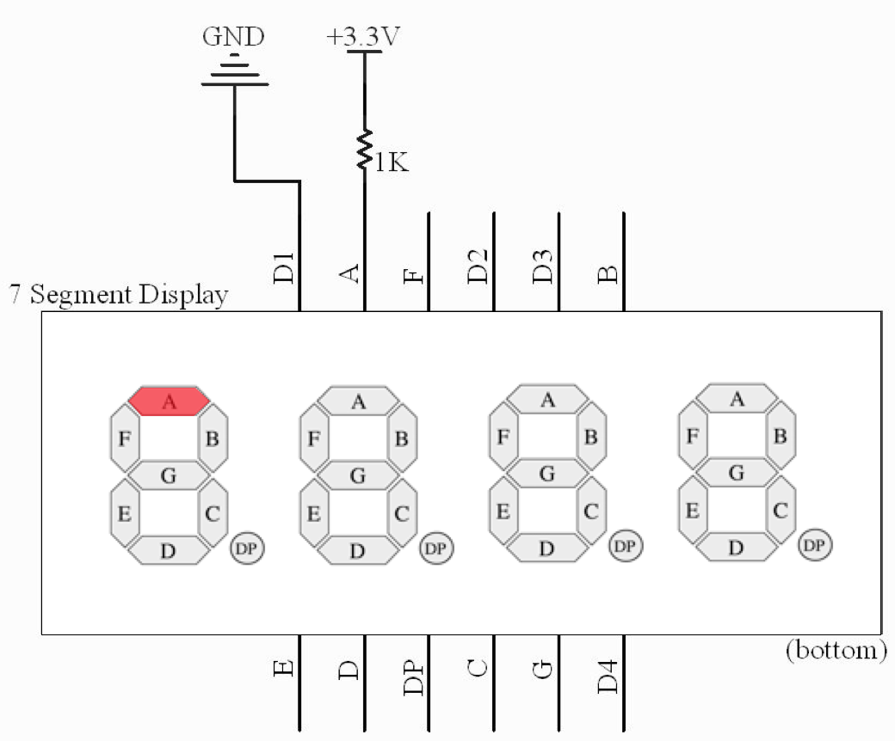


Task list to copy/paste when creating PR for this lab:

__Before releasing lab2:__
- [ ] Review writeup/code/checkin questions (instructor)
- [ ] Walk through (SL)
- [ ] Followup on any github issue from previous

__To prep for lab2:__
- [ ] See private/answers and private/staff_notes for advice saved from past
- [ ] Piazza announcement for students to bring their own tools (also repeated in prelab)
- [ ] Confirm lab cabinet has plenty of hookup wire and hand tools
- [ ] Make copies of 7-segment pinout diagram



*Lab written by Pat Hanrahan*


_Death Valley, CA (a most awesome place to visit; if you haven't gone, plan a trip now!)_

## Goals

During this lab you will:

- Understand the assembly language produced by `gcc` when compiling a C program.

- Understand basic makefiles.

- Learn how to unit test your C program.

- Breadboard a 4-digit 7-segment display 
   for your next assignment, the clock.

## Prelab preparation

To prepare for this lab, you should do the following:

1. Read our [gcc guide](/guides/gcc)
   about how to compile C programs for bare metal
   programming on the Raspberry Pi.

2. Read our [make guide](/guides/make)
   on setting up makefiles for cross-development
   on the Pi.

3. Read [section 1.1 of this lab](#crossref) on the theory of operation
   for 7-segment displays. If you have time, skim the rest of section 1 to get the lay of the land for the breadboarding work.
    - You will be doing a lot of breadboarding in this lab and using hand tools such as wire strippers, cutters and pliers.  We will have tools available, but there is not enough for everyone, so you will have to share them. __If you have your own tools, please bring them to lab!__ 
    - [Pat's advice](/guides/tools/) on owning your own tools.

4. Clone the lab repository from `https://github.com/cs107e/lab2`.


## Lab exercises

First things first: get some snack and pair up with a buddy and introduce yourself! Pull up the [check-in](checkin) questions to ponder as you work through lab. We don't grade you on correctness of your answers; instead these are an opportunity to check-in with us and ensure you have the necessary understanding to tackle this week's assignment.

<a name="crossref"></a>
### 1. Wire up display breadboard (6:30 - 7:30)

The first half of the lab period will be devoted to wiring up the breadboard circuit needed for Assignment 1, a clock implemented on a 4-digit 7-segment display. 

The lab exercise will step you 
through the process and has you test each stage before moving on. 
A "test as you go" strategy is the hallmark of a great engineer, please follow along carefully!  Do not cut corners in a mad rush to finish your entire circuit in lab; the goal is that you leave lab with a solid start and a clear understanding of how to complete the rest on your own.

#### 1.1) Theory of operation

Let's start by understanding how a single 7-segment display works. 
<span class="pull-right" markdown="1">

</span>
The 7-segment display, as its name implies, is comprised of 7 individually lightable LEDs, labeled A, B, C, D, E, F, and G. There is also a decimal point labeled DP. Each segment is an LED. Recall that an LED has an anode and a cathode. The polarity matters for an LED; the anode voltage must be positive relative to the cathode for the LED to be lit. If the cathode is positive with respect to the anode, the segment is not lit.

On the 7-segment displays we are using,
the cathodes (ground) are all connected together,
to a single ground. 
Such a display is called a *common cathode* display.


To display a digit, you turn on the appropriate segments by connecting the
common cathode (ground) to ground and applying a voltage to those segment
pins. Turning on all the segments would show the digit "8". Here is a
[nice online simulation of a 7-segment display](http://www.uize.com/examples/seven-segment-display.html).

Your clock will display minutes and seconds.
We will need two digits for the minutes and two digits for the seconds,
for a total of four digits.
We will be using four 7-segment displays integrated into a single unit, as shown in the photo below:

[](images/display.jpg)

Here is the schematic for the four-digit 7-segment display:

[](images/display.schematic.png)
Untangling the schematic can be a bit tricky. There are twelve pins in total: four digit pins (`DIG.1`, `DIG.2`, `DIG.3`, and `DIG.4`) and eight segment pins (`A`, `B`, `C`, `D`, `E`, `F`, `G`, `DP`). Each segment pin connects to all four digits (trace from the pin numbered 11 to see the connections to the `A` segment for each digit). Each digit has its own unique ground, e.g. `DIG.1` is the cathode/ground pin for digit 1 (trace how all eight segments connect to this shared ground).
If you turn on segment
pins `B` and `C`, and connect `DIG.1` and `DIG.2` to ground, the first
and second digits will both display "1" while the third and 
fourth digits will not display anything (their ground is not
connected).

The photo below shows the placement of the pins on the display. Note that the `DIG.1`,
`DIG.2`, `DIG.3`, and `DIG.4` labels have been shortened to `D1`, `D2`, `D3`, and `D4`. The pins are also numbered for reference. By convention, the numbering starts at the bottom left corner (pin #1), and proceeds in a counter-clockwise fashion until reaching the upper left corner (pin #12).


You and you partner should discuss the first [checkin](checkin) question now!

#### 1.2) Wire up resistors/segments

In this step, you are going to wire up the segments of the display and turn
them on. For ease of debugging, we recommend that you first wire up the display
using jumper cables. After validating your circuit, you will re-wire it in
a more neat and permanent fashion.

*Note: The wires in lab are #22 AWG solid core. Some of the wire strippers have a
 #22 hole that is perfect for stripping the wire.*
 
First, connect the two power rails and two ground rails on your breadboard.
This makes accessing power and ground via jumpers more convenient. My
convention is to always orient my breadboard so that the blue ground rail is on
the bottom (after all, ground is always underneath us).


Now insert the display onto the breadboard. Make sure the display is
oriented correctly (the decimal points should be on the bottom, and the digits
slanted to the right). We recommend placing the display at one edge of the
board to allow plenty of space for wiring.

Take note of the numbering on your breadboard when you place your
display. Knowing which breadboard column number aligns with each pin is helpful since after you insert the display into the breadboard you can no longer
see the pins. We chose to place our display so __pin 1 of the display is aligned with column 50 on the breadboard__.

The display LEDs require a current-limiting resistor just as the LEDs in your larson scanner did. Place a 1K resistor on the board bridging the
middle. Use the cutter to clip the leads so that it sits neatly. 

Use a pair of red and black male-female jumpers to connect the power and ground rails of the breadboard to the 3.3V and Ground
pins on your Raspberry Pi. Pick out three short male-male jumpers (orange for 3.3V, black for GND, and green). Use the orange jumper to connect the top of
the resistor to the red power rail. Use the green jumper from the bottom of the resistor to
segment A (Pin 11, which will be at breadboard columns 51 if you aligned Pin 1
to column 50 as described above). Use the black jumper to tie digit D1 (Pin 12, column 50) to the ground rail. When you apply power to your Rasberry Pi, segment A of
digit 1 should light up as shown below:


You can change which segment and digit is lit by moving your jumpers to different pins. Move
your segment jumper to light up segment B instead of segment A. Move your
digit jumper to light up segment B of digit 2 instead of digit 1. Add an
additional jumper to light up segment B of **both** digits 1 and 2.  Note
that you cannot simultaneously display different segments on different digits:
Why not?

For the remainder of the lab, the breadboard samples will be accompanied by
_circuit schematics_. Here's the diagram we used to generate the breadboard
shown above. 



Can you identify all of the components in the above schematic?

Now place seven additional 1K resistors on your breadboard, bringing the total to eight, one for each segment. We
suggest the convention that the leftmost resistor controls segment A, and so
on such that the rightmost resistor controls segment DP. After you add the
resistors, test your circuit. Simultaneously wiring up all segments with 8
jumper cables can be messy; instead use a pair of jumpers to wire up 2 segments
at a time and move the jumpers to test all 8. As you go, you may want to make a
sketch of the correct connection between each resistor and its display pin you
can refer to when wiring up the permanent circuit.

Wire up your jumpers to display the pattern `"1 1 "`, just as in
the schematic below. Here a space means that the digit is blank (no segments
turned on). 


#### 1.3) Wire up transistors/digits

Up to now, you have been controlling whether a digit is on by adding or
removing a jumper that connects the digit pin to ground. We eventually want to
control which segments and digits are turned on using the Raspberry Pi GPIO
pins, so we need an electronic switch that can be controlled by these pins.
To do this we will use bipolar-junction transistors, or BJTs. 

A transistor has three terminals— the base (B), collector (C), and emitter (E).
The base controls the amount of current flowing from the collector to the
emitter. Normally, no current flows from collector to emitter. This condition
is an open circuit. However, if you apply 3.3V to the base, the collector will
be connected to the emitter and current will flow. This is equivalent to
closing the switch.

We will be using 2N3904 transistors. The following diagram identifies which
pins on the 2N3904 are collector, base, and emitter.


The transistor cap has a flat side and a rounded side. If you are looking
at the flat side with the legs pointing down, the leftmost leg will be the
emitter.

Instead of wiring a digit pin directly to ground as before, you will connect the digit pin to the collector of a transistor whose emitter is connected to ground.
Now applying power to the transistor base activates the switch and grounds the
digit pin.

First, disconnect the direct connections from your digit pins from ground.
Place the four transistors in your breadboard. Once again, we suggest laying out your
transistors such that the leftmost transistor will control digit pin D1 and the
rightmost, pin D4.

Now let's connect up D1's transistor. Wire the collector to D1 and the emitter
to ground. Connect the base to the control voltage through a 1K
current-limiting resistor.

Apply power to the base of the transistor.
You should see `"1 ‍ ‍ ‍ "` on the display.

Here's a board and matching schematic where we've connected _both_ D1 and D3 to
the collectors of transistors and applied power to the bases of those two
transistors, which displays `"1 1 "`.


Test your transistor-controlled display by turning on each digit
individually with a pattern such as `1`.

#### 1.4) Permanently wire circuit

Now comes the time-consuming part. Each segment pin needs to be connected to
its resistor and each digit pin connected to the collector of its transistor.
Be patient, this takes some time. However, if it's taking you more than half
an hour or so in lab, try moving on and coming back to this part.

Here's a photo of what it should look like before wiring...


...and here is a full schematic of what you will be wiring up:


In the diagram above, the 3.3V input we've been using up to this point has been
replaced by labeled dots where you should connect jumpers from the GPIO pins on
the Pi. For example, setting Pins 10 and 20 to high will turn on the top
segment of the first digit.

When you wire your breadboard, be sure to choose (or cut) wires of the proper length and arrange them neatly. Use different colors of wires to annotate what they are for. If they're neat, it's easier to see if everything is set up correctly. Take your time and check your work. A little bit of care here will save you a lot of time later, because, when your system has a bug, the set of things that you have to check is much smaller.


---
Here is a photo of Pat's completed breadboard. What a masterpiece! (Note that this board includes the optional buttons used in the assignment extension.)


#### 1.5) Connect to Raspberry Pi

The final step is to connect the display to the GPIOs of your Raspberry Pi
so you can control the display with a program. We will outline the process in
the next few paragraphs. However, there is no need to do this in lab. You
should be able to do this on your own outside of lab.

Use GPIOs 10-13 to control the four digits. GPIO 10 will control the
first digit, GPIO 11 will control the second digit, and so on. Use GPIOs 20-27 to control the eight segments (A-G and DP). GPIO 20 will
control segment A, GPIO 21 will control segment B, etc. In total, we will use
twelve GPIOs on the Pi: eight to control the segments and four to control
the digits.

Setting and clearing GPIOs 20-27 changes which segments
light up. Setting and clearing GPIOs 10-13 turns the transistors on
and off to control which digits light up.  Add some logic to keep track of time,
and you have a clock!

### 2. C to assembly (7:30-7:50)

For this exercise, you will observe the handiwork of the compiler in translating from C to assembly. Going forward, you aren't likely hand-code much more assembly, but you still have much occasion to read it, and these exercises work at developing the skills and fluency to follow along with your compiler.

As we will see, sometimes the assembly
produced by the C compiler can be surprising. 
Using your ARM superpowers, you can dig into the generated 
assembly and figure out what the compiler did, instead of sitting 
there dumbfounded when an executing program does not behave as expected!

Go to the `lab2/code/codegen` directory. Open the `codegen.c` source file in
your text editor. The file contains four parts that concern different aspects of C: arithmetic, if/else, loops, and pointers.

Skim the C code and read our comments. 

In your browser, bring up the [Compiler Explorer](https://godbolt.org/z/fztCXO). This link pre-configures the compiler to `ARM gcc 5.4.1 (none)` and flags `-Og` as a reasonably close approximation of our compiler version/environment.

Copy the  `part_a` function
from `codegen.c` and paste into the Compiler Explorer source pane on the left. Now read through the generated assembly shown in the right pane. Follow along with the compiler's translation and verify that the assembly accomplishes what was asked for in the C source. Do you note any surprising choices in how it goes about it?  Use our comments in `codegen.c` as the guide for what to watch for and further experiments to try. After you finish exploring `part_a`, do the same with parts b, c, and d.

The Compiler Explorer is great fun for a quick interactive exploration; you can also use your regular command-line tools to see the compiler's handiwork. The command `arm-none-eabi-objdump -d somefile.o` invokes the _disassembler_ to extract the assembly from a compiled object file. Run the command `make codegen.list` to see the steps involved. Open the list file in your text editor and you can review the entire program's worth of assembly.

A great way to learn how a system works is by trying
things. Curious about a particular C construct is translated to assembly? Wonder about the effect of changing the compiler optimization level? Try it out and see. Let your curiosity be your guide!

### 3. Makefiles (7:50 - 8:10)

Put your head together with your partner and read through the following sample Makefile.

```
    NAME = blink

    CFLAGS = -g -Wall -Og -std=c99 -ffreestanding
    LDFLAGS = -nostdlib -e main

    all: $(NAME).bin
     
    %.bin: %.elf
        arm-none-eabi-objcopy $< -O binary $@

    %.elf: %.o
        arm-none-eabi-gcc $(LDFLAGS) $< -o $@

    %.o: %.c
        arm-none-eabi-gcc $(CFLAGS) -c $< -o $@
    
    %.list: %.o
        arm-none-eabi-objdump -d $< > $@

    install: $(NAME).bin
        rpi-install.py $<

    clean:
        rm -f *.o *.elf *.bin *.list
```

Discuss and document all the various features and syntactical
constructs used in this Makefile.

 - What do each of the CFLAGS do?
 - What happens if you just type `make`? Which commands will execute?
 - If you modify blink.c and run `make` again, which commands will rerun?
What part of each target indicates the prerequisites? (A prerequisite means 
that if that file changes, then the target is stale and must be rebuilt)
 - What do the symbols `$<` and `$@` mean?

You should be able to answer the [next check-in question](checkin) now.

### 4. Testing (8:10 - 8:30)

As you write more complicated programs, you'll want to test
them; keeping track of what parts of the program work and what parts don't is essential
to debugging effectively. Starting with assignment 2, we'll provide you with some 
automated tests and tools you can use to write your own tests.

The standard C library contains an `aasert` macro for use as a simple diagnostic. Run the command `man assert` in your Terminal to read about the standard library version. The `assert` macro takes an expression that is expected to evaluate to true. If the expression is, in fact, true, then the assertion succeeds and the program continues on.  If the expression is false, the assertion fails and raises an error.

Running bare metal means no standard libraries, and furthermore don't have printf (yet!), so if we want something akin to assert, we are going to have to cons it up ourselves using whatever resources we have on hand. In the lab2 code, we have supplied a primitive  `assert` that uses the red and green LEDs on board the Pi to signal success and failure.

Let's walk through an example that shows using assertions as rudimentary testing tool.

#### A buggy program

Go to the `lab2/code/testing` directory in your terminal.

The program in `testing.c` defines the `is_odd` and `is_even` functions.  The `main()` function tests `is_odd` and `is_even` by calling the functions on various inputs and asserting that the result is correct. The code for `is_odd`  is incorrect, which in turns is going to cause `is_even` to also be wrong. Don't try to work out the bug by inspection, instead concentrate on how we can using testing to determine what cases do and don't work.

#### Build using make

Running `make` will generate `testing.bin` by a sequence of steps. It first
_compiles_ `testing.c` to `testing.o`, then _links_ that `.o` with some
other object files to form `testing.elf`, then extracts the binary instructions into
`testing.bin`. We will learn more about linking later.

Whenever you make a change to your program, run `make` again to rebuild the program from the changed files.

#### What do you expect?

Before we run the program, let's think about what we expect to
happen. The `assert` macro (in `assert.h`) will call `abort` if its 
argument evaluates to false, but what does `abort` do? (hint: look in `abort.c`)

Next, look at `cstart.c` and determine what will happen if your
program returns from `main()` without an assertion failure (i.e., what
will happen if the program works!). Don't worry about the `bss` stuff
for now: we will talk about that in lecture soon.

__If `is_odd()` has a bug, what would you expect to see on the Pi? In
contrast, what would you expect to see on the Pi if `is_odd()` worked
properly?__


#### Run tests

Run `rpi-install.py testing.bin`. You should get the blinking red
LED of doom. You now know at least one test failed, but which one?
The strategy from here is to iterate, selectively commenting in/out 
test cases and re-running to narrow in on which specific cases fail. 
How many of the test cases pass? How many fail?  Which ones? Why?

Use the information you glean from the test cases to identify what is wrong.
Now fix the bug in `is_odd` so that it works correctly for any argument.
Uncomment all test cases, rebuild, re-run, and bask in the glow of the green light of happiness!

#### Make install

Phew, typing out `rpi-install.py testing.bin` so many times was
incredibly taxing on your poor fingers! Try adding a recipe for
`install` to your Makefile that allows you to build and a run
a test program on your Pi with the single command `make install`.

## Check in

Make sure you [check in](checkin) with a TA before you leave.

## For later

After this lab, on your own time, you may try the following:

1. Finish any parts of `codegen.c` you didn't complete during lab.
2. Go through the Makefile in the `testing/` subdirectory of `code/`.
3. Finish wiring up your beautiful clock breadboard.
