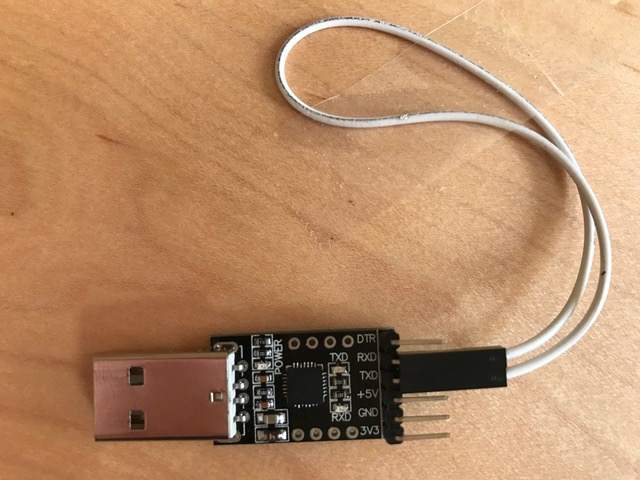


Task list to copy/paste when creating PR for this lab:

__Before releasing lab3:__
- [ ] Review writeup/code/checkin questions (instructor)
- [ ] Walk through (SL)
- [ ] Followup on any github issue from previous

__To prep for lab3:__
- [ ] Be extra careful when reviewing exercise 1, make sure nothing has changed to invalidate the typescript embedded in writeup
- [ ] Make copies of gdb reference sheet and stack diagram to hand out in lab


*Lab written by Pat Hanrahan, updated by Julie Zelenski*

## Goals

During this lab you will:

1. Learn how to use `arm-none-eabi-gdb` in simulation mode. 
Simulation mode is also a good way to learn more about how the ARM processor executes instructions.
2. Trace through function call/return and examine stack frames.
3. Learn how to use `screen` with the USB-serial adapter. Also understand how the UART peripheral works on the Raspberry Pi.
4. Implement a few simple C-string operations and use a combination of
unit testing and gdb simulation to debug your work.

## Prelab preparation
To prepare for lab, do the following: 

1. Read our [guide to gdb simulation](/guides/gdb).
1. Read our [background reading on the stack](stack/).
1. Pull the latest version of the `cs107e.github.io` course repository. Then clone the lab repository
   `https://github.com/cs107e/lab3`.
1.  Verify you have a proper `CS107E` directory with these commands: 

```
$ echo $CS107E
/Users/myname/myfolder/cs107e.github.io/cs107e
$ ls $CS107E
bin/        etc/       final_proj_ref/   include/    lib/       src/
```
   If the above commands do not work as shown, re-do the part of Step 0 of [Assignment 0](/assignments/assign0/) that sets up the directory. If you have trouble, please ask a staff member for help. A properly configured `CS107E` directory is necessary for this lab and all subsequent labs and assignments.

## Lab Exercises
Start by filling your Creativity Spot on the [CS107 Wall of Fame](https://piazza.com/class/jqfaue5sl31ok?cid=49). Now get some snack and find a buddy. Share stories of your adventures writing the clock assignment. Pull up the [check in questions](checkin). You're ready to go!

### 1. Debugging with gdb

The goal of the first exercise 
is to practice using `gdb` in ARM simulation mode.
The debugger allows you to observe and manipulate a running program. Using this tool will teach you more about how ARM instructions are executed and allow you to debug your programs.

#### 1a) Use `gdb` in simulation mode

We will demonstrate `gdb` on a simple example program. 
Change to the directory `lab3/code/simple` directory and review the program in  `simple.c`. Build the program
using `make`.

Run `arm-none-eabi-gdb simple.elf`.  Note that is the ELF 
version `simple.elf` that we use in conjunction with the gdb simulator, 
not the raw `simple.bin` that we have been running on the actual Pi.
(Pay no mind to gdb's warning about a missing Python gdb module)

```
$ arm-none-eabi-gdb simple.elf
GNU gdb (GDB) 7.8.1
Python Exception <type 'exceptions.ImportError'> No module named gdb:

warning:
Could not load the Python gdb module from `/Users/ibush/bin/arm-none-eabi/share/gdb/python'.
Limited Python support is available from the _gdb module.
...
(gdb) 
```

Once inside `gdb`, enter simulation mode and load the program:

```
(gdb) target sim
Connected to the simulator.
(gdb) load
Loading section .text, size 0x188 vma 0x8000
Start address 0x8000
Transfer rate: 3136 bits in <1 sec.
```

Use the commands below to set a *breakpoint* on the `main` function and start executing the program:

```
(gdb) break main
Breakpoint 1 at 0x80e4: file simple.c, line 31.
(gdb) run
Starting program: .../lab3/code/simple/simple.elf 
Breakpoint 1, main () at simple.c:31
```

The debugger stops the program when it reaches the breakpoint. The `next` command executes
the next line of C source.
The command `print d` shows the value of `d`
after the call completes. 

```
Breakpoint 1, main () at simple.c:31
31  {
(gdb) next
34      int d = diff(x, y);
(gdb) next
35      int f = factorial(7);
(gdb) print d
$1 = 74
```

Note that when `gdb` shows your program stopped at a line, 
it's stopped  _before_ that line has executed. At the end of the sequence shown above, the program is stopped before calling 
`factorial`. If you attempt to print `f`
before executing its declaration statement, the debugger
will report that the variable is not (yet) accessible.

Sometimes you want to step into the function being called.
To do this, use `step` instead of `next`. Put another
way, `next` executes the entire next line in the function
you're in, while `step` executes the next line of code, 
which may be in a different function.

Use `run` to restart the program
and then use `step` you hit the breakpoint.

```
(gdb) run
The program being debugged has been started already.
Start it from the beginning? (y or n) y

Breakpoint 1, main () at simple.c:31
16	{
(gdb) step
34      int d = diff(x, y);
(gdb) step
diff (a=a@entry=33, b=b@entry=107) at simple.c:27
27      return abs(a - b);
```

The program is now stopped at the first line of `diff`.   When you `step`, you enter the call to the `abs` function.

```
(gdb) step
abs (v=v@entry=-74) at simple.c:5
5   }
```

Use `continue` to resume executing the program from here.  Wait a moment, and then type `Ctrl-c` to interrupt the running program and return control to gdb. Use the `backtrace` command to see where the program was executing when it was interrupted (ignore the warnings about frame issues):

```^C
Program received signal SIGINT, Interrupt.
0x0000800c in hang ()
(gdb) backtrace
Python Exception <type 'exceptions.ImportError'> No module named frames: 
#0  0x0000800c in hang ()
#1  0x0000800c in _start ()
Backtrace stopped: previous frame identical to this frame (corrupt stack?)
```

The above information tells you that the program is stopped in `hang` which is called from `_start`. Review the code in `start.s` and `cstart.c` to remind yourself of what happens in a C program before and after `main()`. If currently in `hang`, the program has finished and is in the final "holding pattern". This is the normal behavior for a C program that has successfully run to completion. Learn to recognize how this situation is presented in the debugger, you hope to be seeing a lot of successful program completion!

When debugging a function, a common workflow is to

  1. `break` on the function.
  1. Use `next` to step through each line of its code, inspecting variables to see where
     the problem occurs.
  1. If the buggy line of code was a function call, to see what went wrong you'll need to run it
     again, so call `run` again: this will break on the function as in step 1. 
  1. Use `next` to reach the buggy function call, use `step` to drop down into it.
  1. Recursively apply rules 2-4 until you find the bug.

#### 1b) Use `gdb` to observe the stack
If you have not already, please read our supplemental information on the ["Runtime stack"](stack/).

There are gdb commands that allow you to drop down to the assembly instructions and view the current contents of the registers and memory.  Let's try them out!

Use `delete` to delete any existing breakpoints and set a breakpoint at the `diff` function:

    (gdb) delete
    Delete all breakpoints? (y or n) y
    (gdb) break diff
    Breakpoint 2 at 0x80c4: file simple.c, line 26.
    (gdb) run
    Breakpoint 2, diff (a=a@entry=33, b=b@entry=107) at simple.c:26

We asked for a breakpoint on the function `diff` and gdb converted our request to 0x80c4 which corresponds to the address of the first instruction of `diff`. A breakpoint set at 0xAddr will stop the program just before executing the
instruction at 0xAddr. 

The gdb command `disassemble` shows the ARM instructions for a function. Try disassembling the function `diff`:
    
```
(gdb) disass diff
Dump of assembler code for function diff:
=> 0x000080c4 <+0>:     mov r12, sp
   0x000080c8 <+4>:     push {r11, r12, lr, pc}
   0x000080cc <+8>:     sub r11, r12, #4
   0x000080d0 <+12>:    rsb r0, r1, r0
   0x000080d4 <+16>:    bl  0x8010 <abs>
   0x000080d8 <+20>:    sub sp, r11, #12
   0x000080dc <+24>:    ldm sp, {r11, sp, lr}
   0x000080e0 <+28>:    bx  lr
```
Note that the first instruction of `diff` is at
address `0x80c4`, as we expected.

Use the command `info reg` to display all of the current registers.
```
(gdb) info reg
r0             0x21 33
r1             0x6b 107
r2             0x8180   33152
r3             0x8180   33152
r4             0x0  0
r5             0x4a 74
r6             0x0  0
r7             0x0  0
r8             0x0  0
r9             0x0  0
r10            0x0  0
r11            0x7ffffec    134217708
r12            0x7fffff0    134217712
sp             0x7ffffd8    0x7ffffd8
lr             0x80fc   33020
pc             0x80c4   0x80c4 <diff>
cpsr           0x60000013   1610612755
```
What value is currently in `r0`? Why does `r0` contain that value? (Consider: at what point in the program execution are we stopped right now? What was the last use of `r0`?)

You can access a single
register by using the syntax $regname, e.g. `$r0`.

```
(gdb) print $sp
$2 = (void *) 0x7ffffd8
(gdb) stepi
(gdb) stepi
(gdb) print $sp
$3 = (void *) 0x7ffffc8
```

The `stepi` command executes one assembly language instruction.
Note that the value of `sp` has decreased by 16
after executing the first few instructions in `diff`.

When control transfers to the function `diff`, `$sp =
0x7ffffd8`, and then the `sp` is decreased by 16 by the `push`
instruction which stores the four registers that form the APCS frame. 
(Recall that the stack grows downward; the stack pointer
decreases as more values are pushed.)

`gdb` has a very useful feature to auto-display the current value of an expression every time you single-step.
This is done with the `display` command.
The command below will auto-display a sequence of 4 words (w) in hex (x) beginning at the memory location pointed by the current `sp`:

    (gdb) display /4xw $sp
    1: x/4xw $sp
    0x7ffffc8:   0x07ffffec    0x07ffffd8    0x000080fc    0x000080d0

The values printed are the four values topmost on the stack. At the start of `diff`, a `push` instruction placed these four values onto the stack. Examine the disassembly and figure out which four registers
were pushed. These registers correspond to the APCS "full frame".

Because you used the `display` command, gdb will reevaluate and print that
same expression after each gdb command. In this way, you can monitor the
top of the stack as you step through the program. This is quite handy and
much faster than typing `print` after each `next`, `step` or `stepi.`

Here is [a diagram of the state of memory at line 5 in simple.c](images/stack_abs.html). This is at the point right before the `abs` function returns.
The diagram shows the address space of the `simple`
program, including the memory where the instructions are stored, as
well as the contents of the stack.  Studying this diagram will be helpful to confirm your understanding of how the stack operates and what is stored where  in the program address
space. The diagram contains a lot of details, so
finding the exact thing you're looking for can be tricky. Ask questions of your partner and labmates until you all understand how to relate the stack contents to the runtime execution state.

Use `stepi` to move forward from here and review the auto-display'ed stack contents to see what is happening to the values on the stop of the stack:

    (gdb) stepi
    (gdb) [RETURN]
    (gdb) [RETURN]
    (gdb) [RETURN]

Hitting just [RETURN], causes `gdb` to repeat the last command (in this
case `stepi`).

Note how the stack changes as you step through the function.
Which instructions change the value of the register `sp`? Which instructions change the contents of the memory pointed to by `sp`?

Use `delete` to delete all breakpoints. Set a breakpoint on
the `abs` function and re-run the program until you hit this
breakpoint.  Use the gdb `backtrace` to show the sequence of function
calls leading to here (as before pay no mind to the python exception).

```
(gdb) backtrace
Python Exception <type 'exceptions.ImportError'> No module named frames: 
#0  abs (v=v@entry=-74) at simple.c:2
#1  0x000080d8 in diff (a=a@entry=33, b=b@entry=107) at simple.c:27
#2  0x000080fc in main () at simple.c:34
```

The backtrace shows that the function `abs` has been called by `diff`
from line 27, which in turn was called by `main` from line 34.  The
numbers on the left refer to the *frame*.  The innermost frame is
numbered 0, and corresponds to the currently executing function, in this case, `abs`. Frames for caller functions have higher numbers. The `info frame` command prints a summary of the current stack frame:

    (gdb) info frame
    Stack level 0, frame at 0x7ffffc8:
    pc = 0x8010 in abs (simple.c:2); saved pc = 0x80d8
    called by frame at 0x7ffffd8
    source language c.
    Arglist at 0x7ffffc8, args: v=v@entry=-74
    Locals at 0x7ffffc8, Previous frame's sp is 0x7ffffc8

The `info locals` and `info args` commands give more information about the stack frame's arguments and local variables:

    (gdb) info args
    v = -74
    (gdb) info locals
    result = <optimized out>

`info locals` reports that `result` is optimized out! This means that
the compiler decided that it did not need to use the stack to store its value.  Where,
is the value of `result` being tracked? Hint: `disass abs` and look at the
assembly instructions to figure it out. Knowing assembly is useful. 

`gdb` also lets you inspect state of other frames on the call stack.

    (gdb) up
    #1  0x000080d8 in diff (a=a@entry=33, b=b@entry=107) at simple.c:27

This moves "up" the call stack, to the calling function. In this

    (gdb) info args
    a = 33
    b = 107
    (gdb) info locals
    No locals.

Now let's go back "down" to the stack frame for `abs`.

    (gdb) down
    #0  abs (v=v@entry=-74) at simple.c:2

Disassemble the code for `abs` and trace its operation instruction
by instruction.

```
(gdb) disass abs
Dump of assembler code for function abs:
=> 0x00008010 <+0>:     mov r12, sp
   0x00008014 <+4>:     push {r11, r12, lr, pc}
   0x00008018 <+8>:     sub r11, r12, #4
   0x0000801c <+12>:    cmp r0, #0
   0x00008020 <+16>:    rsblt   r0, r0, #0
   0x00008024 <+20>:    sub sp, r11, #12
   0x00008028 <+24>:    ldm sp, {r11, sp, lr}
   0x0000802c <+28>:    bx  lr
End of assembler dump.
```

The first three instructions are the function _prolog_ which set up the
stack frame. Which four registers are pushed to the stack to set up the
APCS frame?  Where/how in the prolog is the frame pointer `fp` anchored?
What location in the stack does the `fp` point to?

The fourth instruction is the body of the `abs` function that does the
comparison operation to determine if `v` is negative. Where does `abs`
read the value of `v` from?  Where does `abs` write the return value of
the function?

The sixth and seventh instructions are the function epilog. The epilog
is responsible for undoing the stack frame and restoring the
saved values for all caller-owned registers that were overwritten.
The `ldm` instruction ("load multiple") is the general-purpose 
instruction of which `pop` is a specific case.

The final instruction of `abs` is branch exchange that returns control
to the caller. Who is the caller of `abs`? What is the address of the 
instruction in the caller that will be executed when `abs` returns?

Once you understand the instruction sequence in `abs`, 
examine the disassembly for `diff` and `main`. 
Identify what portions of the prolog and
epilog are common to all three functions and what portions differ.

The `simple` program contains a few other functions that you can observe to see their use of the stack. 

The `factorial` function operates recursively. Set a breakpoint on the
base case `break 10` and run until the breakpoint is hit. Use the
`backtrace` command to get the lay of the land. Try moving `up` and
`down` and use `info frame` and `info args` to explore the stack
frames. Consider what you expect the stack contents to be at the point where factorial(7) reaches its base case and compare to our [stack diagram for factorial](images/stack_factorial.html).

The remaining function of `simple` demonstrates how the stack is used
for storage of local variables. Simple variables,
e.g. integers, are likely to be stored directly in registers, without writing to stack memory. Larger data
structures, such as arrays and structs, that do not fit in registers must be stored on the
stack. Set a breakpoint on the `make_array` function. Use `info locals` to see the array contents at the start of the function. Are
the array elements initialized to any particular value?  Step through
the loop a few times and use `info locals` to see how the array is
updated. Use this [stack diagram for make_array](images/stack_makearray.html) as a road
map.

Continue to play around with `gdb`.
It is a great way to learn ARM assembly language,
as well as track down bugs in your program.
It also lets you look at both the C and the assembly language source. Becoming
comfortable and fluent with gdb is a key step to becoming a master systems
programmer. Adeptly using `gdb` can improve the speed by which you debug by a factor
of 10 or more. Programmers typically spend 80% of their time debugging, so using
`gdb` can transform a 20-hour assignment into a 5-hour one!

At this point, you should be able to answer the first [check in question](checkin).

### 2. Serial communication
#### 2a) Loopback test

First, insert the USB serial breakout board into a USB port on your laptop.

Verify that the board appears as a `tty` device
(remember, `tty` stands for teletype)

On a Mac:

    $ ls /dev/tty.SLAB_USBtoUART
    /dev/tty.SLAB_USBtoUART

On Linux:

    $ ls /dev/ttyUSB0
    /dev/ttyUSB0

You have been using the USB-serial adapter 
to download programs to the Pi. 
To understand what is going on,
let's do a simple *loop back* test.

Remove the RX and TX jumpers connecting the USB-breakout board to the GPIO pins on the Pi.

Next, connect TX to RX directly on the USB-breakout board.

In loop back mode,
the signals sent out on the TX pin are wired straight to the RX pin.
This causes characters sent out to be echoed back.



We will use `screen` to send and receive characters over the tty port.
First, install `screen` if you don't have screen installed on your computer. 

    Mac:
    $ brew install screen 
    
    Linux:
    $ sudo apt install screen 
    
The command below establishes a connection to the USB-serial 
at the baud rate of 115200. 

    Mac:
    $ screen /dev/tty.SLAB_USBtoUART 115200

    Linux:
    $ screen /dev/ttyUSB0 115200

The screen should be cleared and the cursor positioned
in the upper left hand corner.
Type in some characters.  What happens?
What happens if you type return on your keyboard?

To exit screen, type `Ctrl-a` followed by `k`.
You should see the following message.

    Really kill this window? [y/n]

Typing `y` returns to the shell.

    [screen is terminating]

#### 2b) Echo test

Re-connect the TX/RX jumpers between the USB-serial to the Raspberry Pi. Remember the RX of the USB-serial connects to the TX of the Pi, and vice versa (the connections are __not__ TX-TX and RX-RX).

Change to the directory `lab3/code/echo` and  `make` the program. 
Send the program to the Pi with the command `rpi-install.py -s echo.bin`.  (Invoking
`rpi-install.py` with the `-s` flag will automatically run `screen` after
sending the program.) Any characters you now type should be echoed back to your
terminal.

As you continue typing, have your partner gently unplug the jumper from the RX pin on your USB-serial and then re-connect it. What changes? Why does that happen?

Use `Ctrl-a` `k` to exit `screen`.

#### 2c) UART test

Change to the directory
`lab3/code/uart`.
This program uses the `uart_putc` function
to send characters using the TX pin on the Raspberry Pi. 

    $ cd lab3/code/uart
    $ ls
    Makefile  cstart.c  hello.c   memmap    start.s

Read and understand the source to `hello.c`. Edit `Makefile` to 
change the recipe for the `install` target to
include the `-s` flag when invoking `rpi-install.py`.  Now you can
use `make install` to send the program to the Pi and start `screen`
in one go. 

    % make install
    Found serial port: /dev/cu.SLAB_USBtoUART
    Sending `hello.bin` (1128 bytes): .........
    Successfully sent!
    [screen starting will clear your terminal window here]
    hello, laptop
    hello, laptop
    hello, laptop
    hello, laptop
    hello, laptop
    hello, laptop
    hello, laptop

This will print forever until you reset the Pi. Use `Ctrl-a` `k` to exit `screen`.

#### 2d) printf

Change to the 
`lab3/code/printf` 
directory.
This program repeatedly prints "hello, laptop" using `printf`.
In Assignment 3, you will implement your own version of `printf`.

Once you have a working `printf`, you can use it to report your program state and super-charge your debugging. What a big improvement over trying to communicate everything via blinking LEDs!

For example, you can call `printf("value: %d\n", 10);` 
to print the number 10 or `printf("value: %c\n", 'a');` 
to print the letter a. To learn more about how to use printf, check out
[the documentation for it here](http://www.tutorialspoint.com/c_standard_library/c_function_printf.htm).

Open `hello.c` in your text editor and edit the `main` function to do the following three things:

1. Use `printf` to print the value in the `FSEL2` register in hex form. 

2. Use `gpio_set_function` to make pins 20 and 21 output pins.

3. Print the value of `FSEL2` again.

Reset your Pi, and run `make install` again to see your program's output. How does the hex value stored in `FSEL2` change after changing the pin functions?

### 3. C-strings

For this exercise, you will work with C-string functions and get further practice with unit-testing and debugging.
Change to the `lab3/code/strings` directory and open the `cstrings.c`
file in your editor.

The first string operation to look at is `strlen`. This function returns the count of characters in a C-string. How is it possible to determine where a C-string ends? Is the null terminator included in the count? 

Review the given (correct) code for `strlen` in `cstrings.c`.  It uses array subscripting on a variable declared as a pointer. Why is this legal?  What does it mean to access the nth array element of a pointer variable?

The code for `strlen` is simple enough that you might feel confident calling it correct "by inspection", but let's use our unit testing strategy to truly confirm the behavior of the executing function.

Read through the test cases in the `test_strlen`.
Compile the program and run it on the Pi. You should get the green light of success for passing all the tests. It is a correctly-implemented `strlen` function, as advertised.

Now, let's move on the `strcpy` operation. This function copies the characters from one string to another:

    char *strcpy(char *dst, const char *src);

Spoiled programmers who work on hosted systems receive `strcpy` as part
of the standard library, but we must implement it ourselves for the Pi.

Functions in the standard library each have a man page that documents the function's use and behavior. See the man page for `strcpy`:

    $ man strcpy

Try implementing `strcpy` yourself. Does `strcpy` copy the null terminator or only the non-null characters?  If you're not sure, read the man page to confirm the expected behavior.

When you are ready to test your `strcpy`, review the test cases in the `test_strcpy` function. Uncomment the call to `test_strcpy` in `main()`. Use `make install` to rebuild the program and run it on the Pi.

If you get the red flash of doom, dig in to find out what's gone wrong
and work to resolve the issue. Don't move on until all
tests pass and you earn your green light merit badge.

### 4. More gdb debugging

Next up is further practice using gdb in simulation mode using the program from the previous exercise. Start gdb on `cstrings.elf` and use the gdb commands step/next/print to trace through a run
of your program executing correctly.

#### 4a) Debug strlen


Edit `strlen` to intentionally 
plant a bug, such as changing it to return `i + 1` instead of `i`.  This buggy program is expected to fail the tests in `test_strlen`. Use `make install` to build the program and run on the Pi. You should see the flashing red LED that indicates a failed assert.

Let's learn how a failed assert is presented under the debugger. Get the buggy program under gdb and `run` it. First note that there is no flashing red light. The simulator is not talking to your Pi nor its peripherals. Your Pi doesn't even need to be connected! 

What do you see in gdb? Not much; the program appears to be stuck. Type `Ctrl-c` to interrupt the program and use `backtrace` to see where the program is stopped.

```^C
Program received signal SIGINT, Interrupt.
timer_get_ticks () at timer.c:10
10  timer.c: No such file or directory.
(gdb) backtrace
Python Exception <type 'exceptions.ImportError'> No module named frames: 
#0  timer_get_ticks () at timer.c:10
#1  0x000084b0 in timer_delay_us (usecs=usecs@entry=200000) at timer.c:17
#2  0x000084f8 in timer_delay_ms (msecs=msecs@entry=200) at timer.c:22
#3  0x0000841c in pi_abort () at pi.c:40
#4  0x00008078 in test_strlen () at cstrings.c:28
#5  0x0000822c in main () at cstrings.c:78
```

A-ha! When an assert fails, it calls `pi_abort` to flash the red light. The above backtrace tells you that the program is waiting in the delay loop within `pi_abort`.  Given the simulator does not emulate the timer or GPIO peripherals, `pi_abort` behaves as a no-action infinite loop. By looking further into the backtrace, we learn that the failed assertion occurred on line 28 of the `cstrings.c` file. Use `list` to see that code now:

```
(gdb) list cstrings.c:28
23 
24 void test_strlen(void)
25 {
26     char *fruit = "watermelon";
27 
28     assert(strlen("green") == 5);
29     assert(strlen("") ==  0);
30     assert(strlen(fruit) == 2 + strlen(fruit + 2));
31 }
32 
```

This allows us to pinpoint exactly which assert failed (rather than have to comment-in-and-out tests one by one to find it). Hooray for gdb!

Restore `strlen` to its correct implementation, rebuild and run again under the debugger. All tests should pass. As expected, there is no green light from the simulator, but once again the program appears stuck. Type `Ctrl-c` to interrupt the program and use  `backtrace` to see what's going on. What evidence confirms that the program successfully ran to completion? 


__Tip__: Any time your program is executing, typing `Ctrl-c` will interrupt the program and return control to the debugger. `backtrace` will show where the program was executing when it was interrupted. 

Learn to recognize these two common situations: 
+ a successful run to completion that is waiting in `hang`
+ a failed assert in `pi_abort` valiantly flashing a non-existent red LED
</div>

#### 4b) Debug bogus_strlen_calls

Both `strlen` and `strcpy` have been shown to work correctly for valid calls. We are now going to do a little exploration into what happens 
for calls that are not so kosher. 

Review the code in the aptly-named `bogus_strlen_calls` function. 
Get together with your tablemates and look at the three "bogus" calls.
For each consider __why__ it is invalid: what is improper about the C-string that is being passed as the argument?

The standard C-string library functions are generally not robust against bad calls, especially those that ask a function to read or write invalid memory.  The reason for this is not for performance or
due to laziness -- it's actually not possible for `strlen` to reliably
detect that its argument is not a valid C-string. A `char*` is
not necessarily a pointer to a string -- it could be just a pointer
to a single character. Furthermore the address might not have a char pointee  at all -- it could be an int stored there or the address might be completely invalid or contents uninitialized. The C language does not have a reliable means to determine the validity of a pointer and reject the bad ones.

Uncomment the call to `stress_test_strlen` in `main()`. Rebuild the program and run it under gdb. Single step through the call to
`bogus_strlen_calls` and print the value returned from each of the
bad calls. Is the result what you anticipated?  What did you learn from this about the
observed consequences of reading uninitialized or invalid memory?

#### 4c) Debug sketchy_strcpy_call

Next, review the code for the `sketchy_strcpy_call` function, which attempts to copy a string to an improper destination.
We previously saw that `strlen` was able carry on and silently
blunder through __reading__ from an improper memory location. What is
going to happen when `strcpy` starts __writing__ to one?  With your
partner, draw a diagram on paper of what happens to the stack memory
during this call to `strcpy`.

Edit `main()` to comment out the call to  `stress_test_strlen` and uncomment the call `stress_test_strcpy`. Rebuild and run under `gdb`. Which of the test cases succeeds? Which fails? How is the failure reported?

This code exhibits a classic __buffer overflow__ bug where writing
too much data to a too-small stack buffer overwrites adjacent data
in the stack frame. What is the critical data stored in the stack that has
been destroyed here? At what point in the execution does the
overwritten data result in a bad consequence? 

#### 4d) Differences under simulation
It is important to be aware of the discrepancies you may observe when comparing the behavior of a program running on the Pi versus running under the gdb simulator. Read the section titled [Differences due to simulation](/guides/gdb/#differences-due-to-simulation) in our gdb guide to be introduced to some of the issues you may run into.

Change to the directory `lab3/code/simulator` directory and review the program in the `buggy.c` file  Trace through the operation of the program. What do you predict will be printed as output?

Build the program using `make`. You should get warnings from the compiler about the use of uninitialized variables.

Use `make install` to run the program on the Raspberry Pi. Does the output printed by the program match what you predicted earlier?  Use `make install` to run the program again. Is the output printed the same as the previous run?

Now use gdb on the `buggy.elf` program. This directory has a `.gdbinit` configuration file that will automatically issue the `target` and `load` commands once gdb is started so you don't have to do so manually. Run the program under gdb. When running under the simulator, the program does have the same output that you observed when running on the Pi. Why is it different?

Type `Ctrl-c` to stop the program. Without exiting gdb, use `run` to run the program for a second time. How does this output compare to the previous run? Run a few more times in gdb until you understand the pattern. What have you learned about how the simulator handles the state of memory between runs? How does this compare to what happens to the state of memory when you reset the actual Pi and re-run the program?

## Check in with TA

Review the [check-in questions](checkin) to test your understanding of the
topics from the lab and call over the TA to check-in on your progress before leaving lab.
